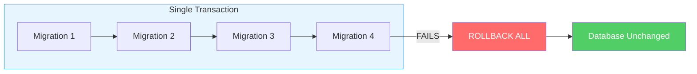
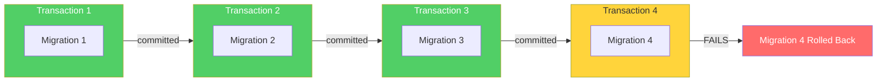

# Skyway

A TypeScript-native database migration tool inspired by [Flyway](https://flywaydb.org/), built specifically for SQL Server.

Skyway eliminates the Java dependency required by Flyway while providing the same migration workflow — versioned migrations, baseline support, repeatable migrations, checksum validation, and schema history tracking. It targets SQL Server using the `mssql` (tedious) driver and wraps migrations in transactions for safe, atomic execution.

## Why Skyway?

Flyway is the gold standard for database migrations, but it requires a Java runtime. For TypeScript/JavaScript projects targeting SQL Server, this means maintaining a Java toolchain alongside Node.js just for migrations. Skyway solves this by reimplementing Flyway's core migration engine natively in TypeScript:

- **No Java required** — runs anywhere Node.js runs
- **Flyway-compatible** — uses the same file naming conventions, history table schema, and checksum algorithm
- **Transaction safety** — wraps migrations in SQL Server transactions (DDL is transactional in SQL Server)
- **Dual interface** — use as a library in your application or as a standalone CLI tool
- **Drop-in replacement** — point Skyway at your existing Flyway migration files and it just works

## Usage

### As a Library

```typescript
import { Skyway } from '@skyway/core';

const skyway = new Skyway({
    Database: {
        Server: 'localhost',
        Database: 'my_app',
        User: 'sa',
        Password: 'secret',
    },
    Migrations: {
        Locations: ['./migrations'],
        DefaultSchema: 'dbo',
        BaselineOnMigrate: true,
    },
    Placeholders: {
        'flyway:defaultSchema': 'dbo',
    },
    TransactionMode: 'per-run',
});

// Apply pending migrations
const result = await skyway.Migrate();
console.log(`Applied ${result.MigrationsApplied} migrations`);

// Check migration status
const info = await skyway.Info();
info.forEach(m => console.log(`${m.Version} [${m.State}] ${m.Description}`));

// Validate checksums
const validation = await skyway.Validate();
if (!validation.Valid) {
    console.error('Checksum mismatch detected:', validation.Errors);
}

// Baseline the database at a version
await skyway.Baseline('202601122300');

// Repair history table (remove failed entries, realign checksums)
await skyway.Repair();

// Clean all objects from the schema
await skyway.Clean();

// Create or drop the database
await skyway.CreateDatabase();
await skyway.DropDatabase();

await skyway.Close();
```

### As a CLI

```bash
# Apply pending migrations
skyway migrate --server localhost --database my_app --user sa --password secret --locations ./migrations

# Show migration status
skyway info

# Validate applied migrations against local files
skyway validate

# Clean database (drop all objects in the schema)
skyway clean

# Baseline an existing database at a version
skyway baseline --baseline-version 202601122300

# Repair history table
skyway repair

# Create or drop the database
skyway create-db
skyway drop-db

# Dry-run mode (show what would be applied without executing)
skyway migrate --dry-run

# Quiet mode (suppress per-migration output)
skyway migrate --quiet
```

### Configuration File

Create a `skyway.json` in your project root. Both camelCase and PascalCase keys are supported:

```json
{
    "Database": {
        "Server": "localhost",
        "Port": 1433,
        "Database": "my_app",
        "User": "sa",
        "Password": "${SQL_PASSWORD}"
    },
    "Migrations": {
        "Locations": ["./migrations"],
        "DefaultSchema": "dbo",
        "HistoryTable": "flyway_schema_history",
        "BaselineOnMigrate": true,
        "BaselineVersion": "1"
    },
    "Placeholders": {
        "flyway:defaultSchema": "dbo"
    },
    "TransactionMode": "per-migration"
}
```

## Migration File Types

Skyway supports the same three migration types as Flyway:

### Versioned Migrations (`V`)

Run once, tracked by version. Applied in version order.

```
V202506130552__Add_Users_Table.sql
V202506140800__Add_Email_Column.sql
```

### Baseline Migrations (`B`)

Applied only to empty databases (no prior migration history). Used to initialize a schema from scratch.

```
B202601122300__v3.0_Baseline.sql
```

### Repeatable Migrations (`R__`)

Run after all versioned migrations whenever their checksum changes. Useful for views, stored procedures, or metadata refresh operations.

```
R__RefreshMetadata.sql
```

## Naming Convention

```
V{version}__{description}.sql
B{version}__{description}.sql
R__{description}.sql
```

- **Version**: Numeric timestamp (`YYYYMMDDHHMM`) or any sortable numeric string
- **Separator**: Double underscore (`__`)
- **Description**: Underscores converted to spaces for display

## Flyway Compatibility

Skyway aims for compatibility with Flyway's behavior and artifacts:

| Feature | Status |
|---------|--------|
| `flyway_schema_history` table | Compatible |
| CRC32 checksums | Compatible |
| Versioned migrations (`V`) | Supported |
| Baseline migrations (`B`) | Supported |
| Repeatable migrations (`R__`) | Supported |
| Placeholder substitution (`${...}`) | Supported (smart — only known placeholders) |
| GO batch separator handling | Supported |
| Transaction wrapping | Supported (per-migration or per-run) |
| Out-of-order migrations | Configurable |
| `clean` command | Supported |
| `baseline` command | Supported |
| `repair` command | Supported |
| `info` command | Supported |
| `validate` command | Supported |
| Dry-run mode | Supported (`--dry-run`) |

## CLI Commands

| Command | Description |
|---------|-------------|
| `skyway migrate` | Apply pending migrations |
| `skyway info` | Show migration status |
| `skyway validate` | Validate applied migration checksums |
| `skyway clean` | Drop all objects in the configured schema |
| `skyway baseline` | Baseline the database at a version |
| `skyway repair` | Remove failed entries and realign checksums |
| `skyway create-db` | Create the target database |
| `skyway drop-db` | Drop the target database |

### CLI Flags

| Flag | Description |
|------|-------------|
| `-s, --server <host>` | SQL Server hostname |
| `-p, --port <port>` | SQL Server port |
| `-d, --database <name>` | Database name |
| `-u, --user <user>` | Database user |
| `-P, --password <pass>` | Database password |
| `-l, --locations <paths>` | Migration locations (comma-separated) |
| `--schema <schema>` | Default schema name |
| `--table <table>` | History table name |
| `--baseline-version <ver>` | Baseline version |
| `--baseline-on-migrate` | Auto-baseline on empty database |
| `--transaction-mode <mode>` | `per-run` (default) or `per-migration` |
| `--dry-run` | Show pending migrations without executing |
| `-q, --quiet` | Suppress per-migration output |
| `--config <path>` | Path to config file |
| `--placeholder <key=value>` | Set a placeholder (repeatable) |

## Improvements Over Flyway

Skyway isn't just a clone — it fixes real pain points with Flyway:

### Atomic Migration Runs (No More Partial Failures)

Flyway executes each SQL statement directly without transaction wrapping. If migration #5 fails halfway through, statements that already executed are committed and **cannot be rolled back**. Your database is left in a broken, partially-migrated state that requires manual intervention to fix.

Skyway takes advantage of SQL Server's transactional DDL support to wrap migrations in transactions. You choose the behavior:

| Mode | Behavior on failure | Use case |
|------|-------------------|----------|
| `per-run` (default) | **All** pending migrations roll back | Maximum safety — your database is either fully migrated or completely untouched |
| `per-migration` | Only the failed migration rolls back; previously completed migrations stay | When you want partial progress preserved |

#### Flyway (No Transaction Safety)


Migrations 1-3 are committed. Migration 4 is half-applied. Database is in a **broken state** requiring manual cleanup.

#### Skyway `per-run` Mode (Default)



All migrations run inside one transaction. Any failure rolls back **everything**. Database remains exactly as it was.

#### Skyway `per-migration` Mode



Migrations 1-3 stay committed. Only migration 4 rolls back cleanly — no partial state.

```typescript
const skyway = new Skyway({
    // ...
    TransactionMode: 'per-run', // all-or-nothing (default)
});
```

### Smart Placeholder Handling

Flyway treats **every** `${...}` occurrence as a placeholder, which breaks migration files containing JavaScript template literals, embedded code, or other uses of the `${...}` syntax. If your SQL migration inserts a stored procedure body containing `${myVar}`, Flyway will either error out or silently corrupt the value.

Skyway only substitutes **known placeholders**:
- `${flyway:defaultSchema}`, `${flyway:timestamp}`, and other `${flyway:*}` built-in placeholders are always substituted
- User-defined placeholders registered in the `Placeholders` config are substituted
- All other `${...}` patterns are **left untouched**

This means migrations containing JavaScript code, JSON templates, or any other `${...}` syntax work correctly without escaping or workarounds.

### Large String Support (No 4000-Character Truncation)

Flyway's JDBC-based execution can truncate or corrupt strings longer than 4000 characters — a known limitation when working with `NVARCHAR(MAX)` columns. This is problematic for migrations that insert large text values (code, HTML, JSON blobs, etc.).

Skyway uses the `mssql` (tedious) driver with explicit `NVARCHAR(MAX)` type declarations, ensuring strings of any length are transmitted to SQL Server intact. No truncation, no corruption, regardless of string size.

## SQL Server Transaction Support

Unlike MySQL or PostgreSQL, SQL Server supports transactional DDL — `CREATE TABLE`, `ALTER TABLE`, and most schema changes can be rolled back within a transaction. Skyway takes full advantage of this with its `per-run` and `per-migration` transaction modes (see [Atomic Migration Runs](#atomic-migration-runs-no-more-partial-failures) above).

## Development

```bash
npm install
npm run build
npm test
```

## License

MIT
